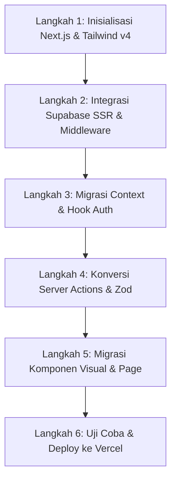

Saya telah memperbarui dokumen rencana implementasi dengan panduan mendalam langkah-demi-langkah khusus untuk Opsi 1 (Next.js App Router).

Rencana ini dirancang secara terstruktur dan taktis agar bisa langsung dipahami secara presisi oleh AI Agent (seperti v0, Lovable, Bolt.new, Cursor) atau Programmer Junior. Dokumen ini memastikan pondasi aplikasi sangat kuat untuk menampung fitur saat ini maupun modul masa depan (seperti Rekam Medis & Manajemen Obat) tanpa merusak keamanan database dan alur bisnis yang sudah matang.

Rincian lengkap rancangan ini dapat Anda baca di: 👉 
implementation_plan.md

Ringkasan Poin Utama Rencana Rebuild:
Pemetaan Struktur Folder: Standarisasi folder Next.js App Router (app/), pemisahan komponen antarmuka (components/), logika server (actions/), dan utilitas integrasi database (lib/supabase/).
Keamanan & Autentikasi: Penggunaan Next.js Middleware untuk auth gating di sisi server secara instan, serta integrasi pustaka resmi @supabase/ssr untuk sinkronisasi sesi login.
Data Fetching & Mutasi: Server Actions Next.js dengan validasi ketat menggunakan Zod dan penulisan log aktivitas melalui helper touchUserActivity di 

audit.server.ts
.
Keamanan RLS & State Machine: Penjelasan bagaimana RLS PostgreSQL dan trigger is_registered tetap menjadi pilar utama keamanan data terlepas dari pergantian framework frontend.

# IMPLEMENTASI SIPKESMAS: NEXT.JS APP ROUTER

Dokumen ini merinci arsitektur **Next.js App Router** SIPKESMAS agar mudah dibaca, dikelola, dan dikembangkan tanpa menurunkan kualitas arsitektur keamanan (RLS), *workflow draft-to-registered*, dan *audit trail*.

---

## 1. Arsitektur Inti & Struktur Folder

Struktur folder baru dirancang menggunakan standar emas Next.js App Router, membagi kode dengan tegas antara komponen antarmuka (Client), logika server (Server Actions), dan konektor database (Supabase).

```text
sipkesmas/
├── app/                                 # Next.js App Router (Halaman & Routing)
│   ├── layout.tsx                       # Root layout (Provider & CSS Global)
│   ├── page.tsx                         # Landing Page (Auto-redirect ke login / dashboard)
│   ├── login/
│   │   └── page.tsx                     # Halaman Login
│   └── dashboard/
│       ├── layout.tsx                   # Layout dashboard (Sidebar & Topbar)
│       ├── page.tsx                     # Dashboard utama role-aware
│       ├── puskesmas/
│       │   └── page.tsx                 # CRUD Puskesmas (Dinkes)
│       ├── users/
│       │   └── page.tsx                 # CRUD Manajemen User (Dinkes / Puskesmas)
│       ├── keluarga/
│       │   ├── page.tsx                 # Daftar Keluarga & Pencarian (Role-aware)
│       │   ├── tambah/
│       │   │   └── page.tsx             # Form Tambah Keluarga
│       │   └── [keluargaId]/
│       │       └── page.tsx             # Detail Keluarga, Anggota, & Timeline
│       ├── kunjungan/
│       │   ├── page.tsx                 # Daftar Kunjungan
│       │   ├── tambah/
│       │   │   └── page.tsx             # Form Catat Kunjungan Baru
│       │   └── [kunjunganId]/
│       │       └── page.tsx             # Detail Kunjungan & Catatan Asuhan
│       ├── audit-log/
│       │   └── page.tsx                 # Log Audit (Dinkes / Admin Puskesmas)
│       └── pengaturan/
│           └── page.tsx                 # Profil & Pengaturan Akun
├── components/                          # UI Reusable Components
│   ├── ui/                              # Komponen primitif shadcn/ui
│   └── common/                          # Komponen global (PageHeader, StatusBadge, dll.)
├── actions/                             # Next.js Server Actions
│   ├── auth.ts                          # Logika server login/logout
│   ├── keluarga.ts                      # Logika server CRUD & State Keluarga
│   ├── kunjungan.ts                     # Logika server CRUD & State Kunjungan
│   ├── users.ts                         # Logika server kelola user & reset password
│   └── puskesmas.ts                     # Logika server kelola Puskesmas
├── hooks/                               # React Hooks kustom
│   ├── use-auth.tsx                     # React Context untuk session & profile
│   └── use-mobile.tsx                   # Deteksi responsivitas sidebar
├── lib/                                 # Utilitas & Supabase Integrasi
│   ├── supabase/
│   │   ├── client.ts                    # Client Supabase untuk komponen browser
│   │   ├── server.ts                    # Client Supabase untuk Server Component & Action
│   │   ├── admin.ts                     # Admin client (Bypass RLS, key rahasia)
│   │   └── middleware.ts                # Interseptor rute (Auth guard)
│   └── utils.ts                         # Helper clsx & tailwind-merge
├── styles/
│   └── globals.css                      # Tailwind v4 entry point & design tokens
├── middleware.ts                        # File middleware Next.js global
├── package.json
└── tsconfig.json
```

---

## 2. Rencana Migrasi Langkah Demi Langkah

> [!TIP]
> Instruksikan AI Agent atau junior developer Anda untuk mengikuti urutan ini guna menghindari error import dan menjaga keselarasan tipe data (*TypeScript*).



### Langkah 1: Inisialisasi Next.js & Konfigurasi Awal
1. Inisialisasi proyek Next.js dengan opsi TypeScript dan ESLint:
   ```bash
   npx create-next-app@latest ./ --typescript --eslint --src-dir=false --experimental-app
   ```
2. Instal dependensi styling Tailwind v4 dan komponen UI:
   ```bash
   npm install @tailwindcss/postcss postcss
   npm install lucide-react class-variance-authority clsx tailwind-merge sonner
   ```
3. Konfigurasikan token OKLCH (Light & Dark Mode) di file `styles/globals.css` sesuai desain token awal Anda.

### Langkah 2: Integrasi Supabase SSR & Middleware Keamanan
1. Instal SDK resmi Supabase SSR:
   ```bash
   npm install @supabase/ssr @supabase/supabase-js
   ```
2. Buat file inisialisasi client di `lib/supabase/`:
   * `client.ts` menggunakan `createBrowserClient` (untuk UI interaktif di client).
   * `server.ts` menggunakan `createServerClient` (untuk Server Components & Server Actions).
   * `admin.ts` menggunakan `createClient` biasa dengan `SUPABASE_SERVICE_ROLE_KEY` (hanya boleh dieksekusi di server untuk bypass RLS, contohnya pada penulisan *Audit Log*).
3. Implementasikan `middleware.ts` global untuk memeriksa cookie auth Supabase:
   * Proteksi rute `/dashboard/*`. Jika sesi kosong, arahkan langsung ke `/login`.
   * Jika user yang login memiliki status `is_active = false`, otomatis paksa logout dan kembalikan ke halaman login.

### Langkah 3: Migrasi Context & Hook Auth (`useAuth`)
1. Di `hooks/use-auth.tsx`, buat Provider yang mendengarkan perubahan auth via `supabase.auth.onAuthStateChange`.
2. Saat user terdeteksi login, lakukan *query* asinkron untuk mengambil profile (`profiles`) dan peran user (`user_roles`) dari Supabase client.
3. Bagikan status tersebut (`user`, `profile`, `role`, `isLoading`) melalui React Context ke seluruh komponen di bawah layout `/dashboard`.

### Langkah 4: Konversi Server Functions ke Server Actions
Semua fungsi logic di `src/lib/*.functions.ts` harus dikonversi menjadi Next.js Server Actions di folder `actions/`.

* **Validasi Strict Zod**: Setiap Action harus menerima parameter data mentah dan memvalidasinya langsung di baris pertama fungsi sebelum data diproses ke database.
* **Perlindungan Role (Assert Role)**: Buat fungsi helper `assertRole(allowedRoles: AppRole[])` untuk membaca peran user dari session server. Jika tidak sesuai, lemparkan error `Unauthorized`.
* **Menulis Audit Log**: Gunakan `supabaseAdmin` (dari `lib/supabase/admin.ts`) untuk mencatat mutasi data ke tabel `audit_logs` secara konsisten demi menjaga rekam jejak sistem.

Contoh struktur file `actions/keluarga.ts`:
```typescript
"use server"

import { createClient } from "@/lib/supabase/server";
import { supabaseAdmin } from "@/lib/supabase/admin";
import { z } from "zod";

const keluargaInputSchema = z.object({
  nomor_kk: z.string().length(16, "Nomor KK harus 16 digit"),
  kepala_keluarga: z.string().min(2),
  nik: z.string().length(16, "NIK harus 16 digit"),
  alamat: z.string().optional(),
  puskesmas_id: z.string().uuid(),
});

export async function createKeluargaAction(rawData: unknown) {
  const supabase = await createClient();
  
  // 1. Verifikasi Auth & Role
  const { data: { user } } = await supabase.auth.getUser();
  if (!user) throw new Error("Unauthorized");
  
  // 2. Validasi Data Masukan
  const validated = keluargaInputSchema.parse(rawData);
  
  // 3. Eksekusi database query
  const { data, error } = await supabase
    .from("keluarga")
    .insert({ ...validated, workflow_status: "draft" })
    .select()
    .single();
    
  if (error) throw new Error(error.message);
  
  // 4. Catat ke Audit Log menggunakan Admin Client
  await supabaseAdmin.from("audit_logs").insert({
    actor_id: user.id,
    action: "create_keluarga",
    entity: "keluarga",
    entity_id: data.id,
    description: `Membuat draft keluarga baru dengan KK ${validated.nomor_kk}`,
  });
  
  return data;
}
```

### Langkah 5: Migrasi Komponen Visual dan Halaman
1. Pindahkan komponen `src/modules/*` ke folder `components/` atau buat sub-folder fitur di dalam `app/dashboard/`.
2. Untuk halaman-halaman dashboard (seperti `/dashboard/keluarga`), buat file `page.tsx` sebagai Server Component untuk mengambil data awal (*data pre-fetching*) dari database Supabase secara instan pada sisi server.
3. Teruskan data tersebut ke Client Component untuk urusan interaktivitas seperti form filter, pencarian teks, pencatatan kunjungan, dan dialog pop-up.

---

## 3. Strategi Pengelolaan Data & Penguatan Masa Depan

Guna mendukung penambahan fitur mendatang (Master Block B: Rekam Medis & Manajemen Obat), kerangka kerja ini dirancang dengan prinsip-prinsip berikut:

### A. Keamanan Akses Data (Row Level Security - RLS)
* **RLS Tetap Menjadi Benteng Utama**: Struktur login dan akses data di level baris tabel PostgreSQL tidak diotak-atik.
* Seluruh operasi mutasi biasa di Server Actions dijalankan dengan client `lib/supabase/server.ts` yang membawa token user (RLS aktif). Database PostgreSQL akan menolak secara otomatis jika perawat dari Puskesmas A mencoba mengubah data di Puskesmas B.
* `lib/supabase/admin.ts` (bypassing RLS) **hanya boleh** diimpor dan digunakan di dalam Server Actions untuk keperluan audit log, pembuatan riwayat transisi workflow, atau sinkronisasi data yang tidak melibatkan manipulasi profil pribadi secara ilegal.

### B. Desain Workflow State Machine yang Skalabel
Alur status pendaftaran keluarga/kunjungan dari `draft` ➔ `registered` ➔ `override_dinkes` dipicu melalui database trigger atau Server Actions:
1. Data baru masuk sebagai `draft`.
2. Tombol registrasi memicu Server Action untuk mengubah field `is_registered` menjadi `true`.
3. Setelah bernilai `true`, database PostgreSQL trigger (`keluarga_block_when_registered`) otomatis memblokir aksi `UPDATE` atau `DELETE` dari user biasa (perawat/admin puskesmas).
4. Hanya Admin Dinkes melalui Server Action khusus yang memanggil query override yang diizinkan memodifikasi entitas tersebut.

---

## 4. Tips bagi AI Agent / Programmer Junior untuk Mencegah Hydration Error

Pada Next.js, sering kali terjadi error karena perbedaan data saat server melakukan render pertama dan ketika client melalukan hidrasi (*hydration mismatch*). Terutama pada sistem yang memformat waktu (seperti tanggal kunjungan) dan session user.

> [!WARNING]
> * **Gunakan Penanganan Format Tanggal di Client**: Selalu tampilkan format tanggal/waktu di dalam pembungkus component setelah komponen tersebut terpasang (*mounted*), atau gunakan library formatting di sisi client menggunakan tag `"use client"`.
> * **Hindari Panggilan Window / LocalStorage di Server**: Sesi login harus dibaca melalui cookie yang dikirim ke server (diurus otomatis oleh `@supabase/ssr`), bukan dari `localStorage` browser yang tidak terdeteksi oleh server.

---

## 5. Rencana Verifikasi (Verification Checklist)

Berikut adalah daftar uji yang wajib dilakukan oleh programmer junior atau AI setelah selesai melakukan rebuild:

- [ ] **Uji Akses Rute (Middleware)**: Coba buka `/dashboard` saat belum login. Pastikan browser otomatis terlempar ke `/login`.
- [ ] **Uji Gating Peran (Role-based UI)**: Login sebagai `perawat`. Pastikan menu kelola Puskesmas tidak terlihat dan jika mengakses `/dashboard/puskesmas` secara manual, sistem memunculkan pesan error / memblokir akses.
- [ ] **Uji Immutability Data**: Buat satu data kunjungan, klik register. Coba edit kunjungan tersebut dengan akun `perawat`. Pastikan backend menolak perubahan tersebut.
- [ ] **Uji Override Dinkes**: Login sebagai `admin_dinkes`. Coba edit data kunjungan yang berstatus `registered` tadi. Pastikan Anda dimintai alasan pengubahan (*override note*) dan log pengubahan tercatat lengkap di halaman Audit Log.
- [ ] **Uji Beban Koneksi Database**: Akses halaman daftar keluarga berulang kali secara cepat. Buka tab dashboard di 5 browser berbeda. Periksa di dashboard Supabase bahwa tidak terjadi lonjakan koneksi database aktif yang tidak wajar.
